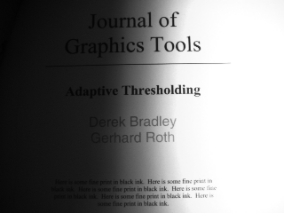

# Enhancing Images to make them readable

using **adaptive thresholding** to enhance the image

- **src**: source (input) image.

− **maxValue**: value to be given if pixel value is more than the threshold value.

− **adaptiveMethod**: adaptive method to be used.

    − **ADAPTIVE_THRESH_MEAN_C** the mean of neighborhood area.

    − **ADAPTIVE_THRESH_GAUSSIAN_C** weighted sum of neighborhood values where weights are a Gaussian window.

− **thresholdType**: type of threshold to be used.

− **blockSize**: size of the pixelneighborhood used to calculate the threshold value.

− **C**: constant used in the both methods (subtracted from the mean or weighted mean).

### Input

### Output

